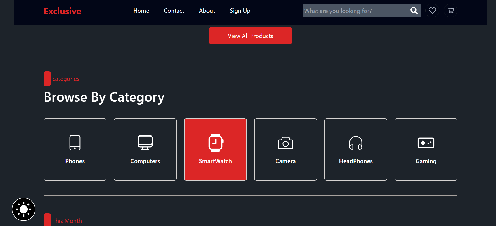
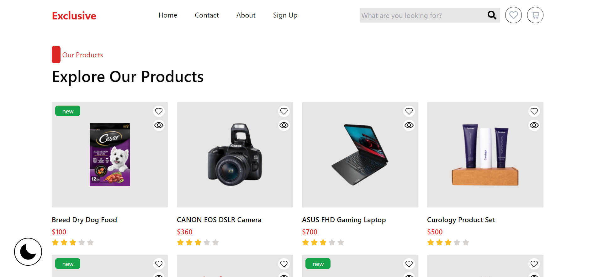
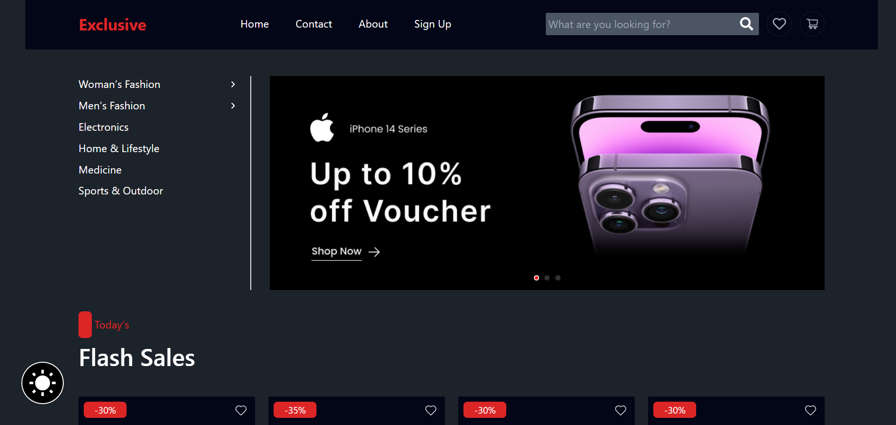

# E-Commerce React App

[DEMO](https://ecommerce-template-omega.vercel.app/)

## Description

A single-page application (SPA) for an e-commerce website, developed using React, React Router, and Tailwind CSS. The app provides a seamless shopping experience with features like responsive design and dark mode.

## Features

- **Home Page**: Includes a slider, flash sales, and product categories.
- **Responsive Design**: Fully responsive layout with dark mode support.
- **SPA Architecture**: Smooth navigation using React Router.
- **Custom Icons**: Integrated with React Icons for consistent and scalable iconography.

## Technologies Used

- **React**: For building user interfaces.
- **React Router**: For client-side routing.
- **Tailwind CSS**: For responsive styling.
- **Vite**: Used instead of CRA for faster project setup and build times.
- **React Icons**: For incorporating scalable icons.

## Installation

### Prerequisites

- Node.js (v14.x or higher)
- npm or yarn

### Setup

1. Clone the repository:
   ```bash
   git clone https://github.com/parsa-sbg/Ecommerce-template.git

2. install dependencies:
    ```bash
    npm install
    or
    yarn install

3. run the development server:
    ```bash
    npm run dev
    or
    yarn run dev
## screenshots :

<br/>



<br/>



<br/>


